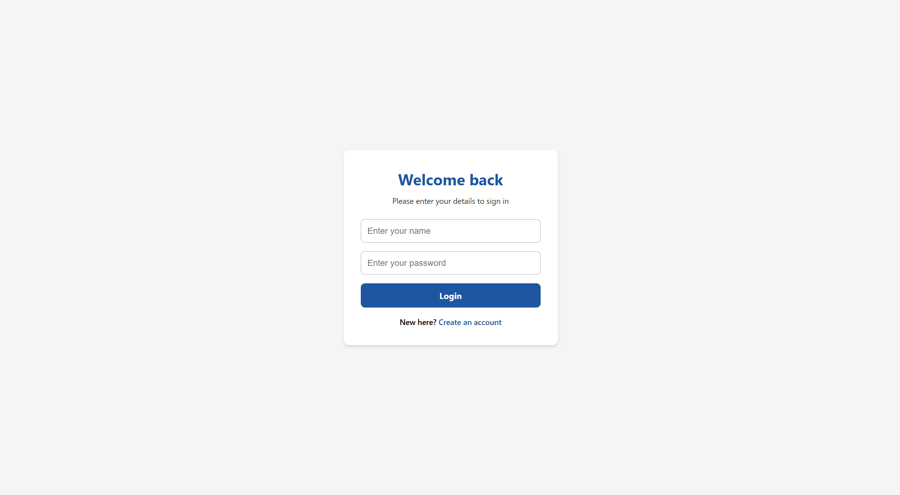
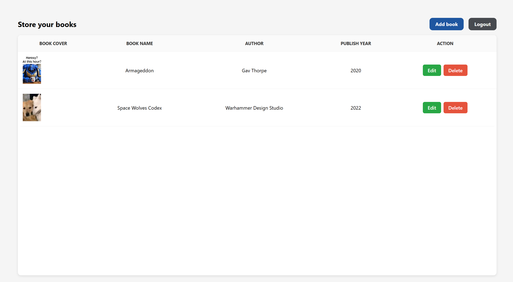

# Book Management System

This is a microservices-based web application for managing book information. The application consists of three main components:
- Authentication Service (auth-api)
- Books Service (books-api)
- React Frontend (front-end)

## Features

<p align="center">
  
  
</p>

- User authentication (signup/login)
- CRUD operations for books
- Book information includes:
  - Name (mandatory)
  - Author
  - Publish year
  - Image upload capability
- Protected routes requiring authentication
- MongoDB Atlas database integration

## Infrastructure as Code (IaC)


## CI/CD


## Setup and Installation

The project uses Docker Compose for easy setup and deployment. Make sure you have Docker and Docker Compose installed on your system.

1. Configure environment variables:
   - Create a .env.local file in the root directory with the following variable:
     ```bash
     JWT_SECRET=your_jwt_secret_here
     ```
   - In case of production, create .env files in `/auth-api` and `/books-api` directories:

     **auth-api/.env:**
     ```bash
     MONGODB_USERNAME=MONGODB_ATLAS_CLUSTER_USERNAME
     MONGODB_PASSWORD=MONGODB_ATLAS_CLUSTER_PASSWORD
     MONGODB_HOST=<cluster>.mongodb.net
     MONGODB_DB=users_dev
     APP_ENV=production
     ```
     
     **books-api/.env:**
     ```bash
     MONGODB_USERNAME=MONGODB_ATLAS_CLUSTER_USERNAME
     MONGODB_PASSWORD=MONGODB_ATLAS_CLUSTER_PASSWORD
     MONGODB_HOST=<cluster>.mongodb.net
     MONGODB_DB=books_dev
     APP_ENV=production
     ```

2. Build and start all services:
   ```bash
   docker compose up --build
   ```

This will start:
- MongoDB database
- Authentication service on http://localhost:5000
- Books service on http://localhost:5001
- Frontend application on http://localhost:3000 (development mode)

## API Endpoints

### Auth Service (http://localhost:5000)
- POST /register - Register new user
- POST /login - User login

### Books Service (http://localhost:5001)
- GET /books - Get all books for authenticated user
- POST /books - Create new book
- GET /books/:id - Get specific book
- PUT /books/:id - Update book
- DELETE /books/:id - Delete book
